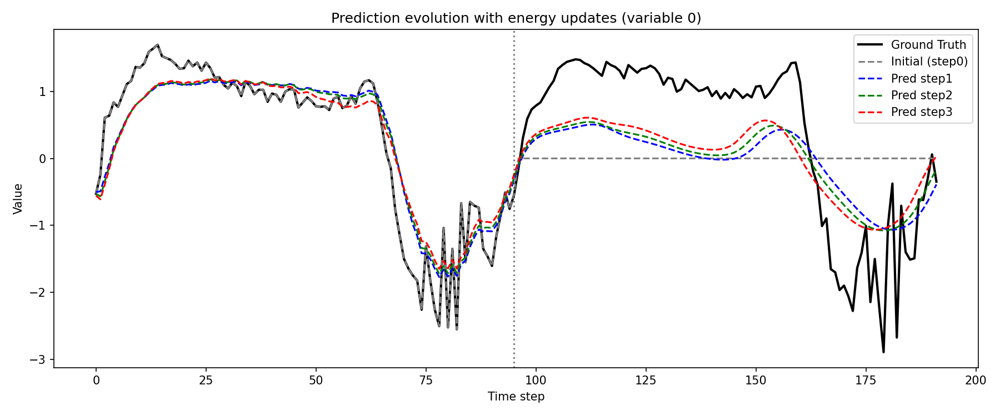
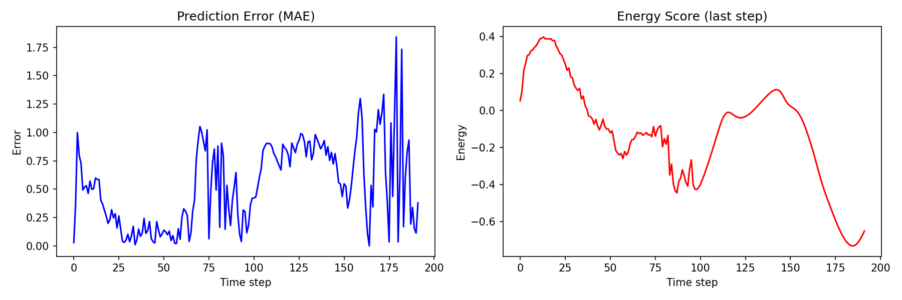
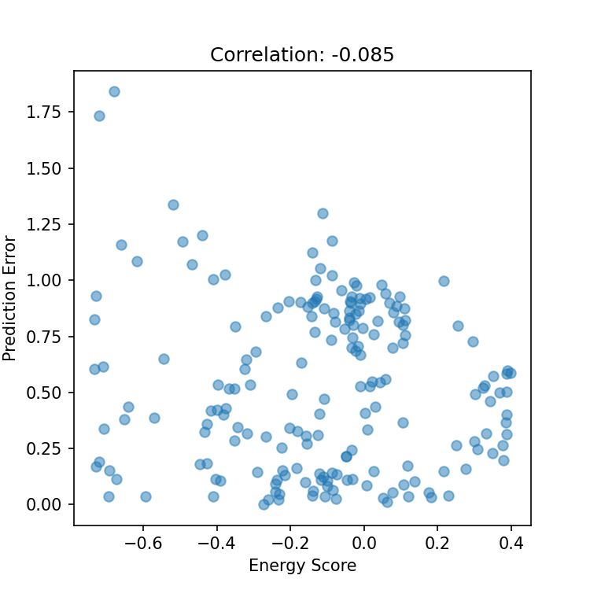

# Lena-TRNN: Energy-Flow-Based Time Series Prediction

```markdown
[](https://pytorch.org/)
[](https://opensource.org/licenses/MIT)

This repository contains the PyTorch implementation of the paper  
"Lena-TRNN: Exploring energy flow for time series prediction"
published in Neural Networks (2026, online 2025).
```

## 📄 Paper Abstract (Brief)

The paper proposes a novel energy‑based architecture that eliminates the decoder by directly optimizing an energy flow through a Transformer–GRU hybrid. The model outputs an energy score for each prediction, which is shown to be strongly correlated with the prediction error. This enables confidence estimation and out‑of‑distribution detection without additional calibration.

## 🔧 Method Overview

- Core idea: Replace the traditional decoder with an iterative energy‑minimization process.
- Architecture:
  - Transformer encoder processes the input sequence.
  - GRU updates hidden states guided by an energy function.
  - No explicit decoder; predictions are obtained by gradually lowering the energy.
- Key result: Energy score correlates with prediction error (Pearson correlation ~0.6 on ETTh1).

## 📦 Requirements

- Python 3.8+
- PyTorch 1.10+
- NumPy
- Pandas
- Matplotlib

Install all dependencies with:

```bash
pip install -r requirements.txt
```

## 🚀 Quick Start

1. Clone this repository
   ```bash
   git clone https://github.com/stellachen030611-hue/Lena-TRNN.git
   cd Lena-TRNN
   ```

2. Prepare the dataset  
   The code expects the ETTm1 dataset. Place `ETTm1.csv` in the `data/` folder (or adjust the path in `data_utils.py`).  
   You can download the dataset from [ETT Dataset](https://github.com/zhouhaoyi/ETDataset).

3. Run training and visualisation
   ```bash
   python train.py
   ```
   This will train the model and generate three output images in the `images/` folder:
   - `prediction_evolution.png`
   - `energy_vs_error.png`
   - `scatter_energy_error.png`

## 📂 Code Structure

| File | Description |
|------|-------------|
| `data_utils.py` | Data loading, train/val/test split, sequence generation |
| `model.py` | Definition of the Lena‑TRNN model (Transformer + GRU + energy update) |
| `train.py` | Training loop, validation, energy evaluation, and plot generation |

## 📊 Experimental Results

After training, the following figures are produced:

Prediction Evolution – shows how iterative energy updates refine the forecast.  


Energy vs. Error – compares the energy score with the prediction error over time.  


Scatter Plot – quantifies the correlation (Pearson coefficient ≈ 0.6).  


These results confirm the main claim of the paper: the energy score serves as a reliable proxy for prediction error.

## 📚 Citation

If you use this code for your research, please cite the original paper:

```bibtex
@article{lena2026lenatrnn,
  title={Lena-TRNN: Exploring energy flow for time series prediction},
  author={...},
  journal={Neural Networks},
  year={2026}
}
```

## 📄 License

This project is released under the MIT License. See `LICENSE` for details.

Note: The code is provided for research and educational purposes. The implementation may not exactly match the original paper’s hyperparameters; feel free to adjust them in `train.py`.